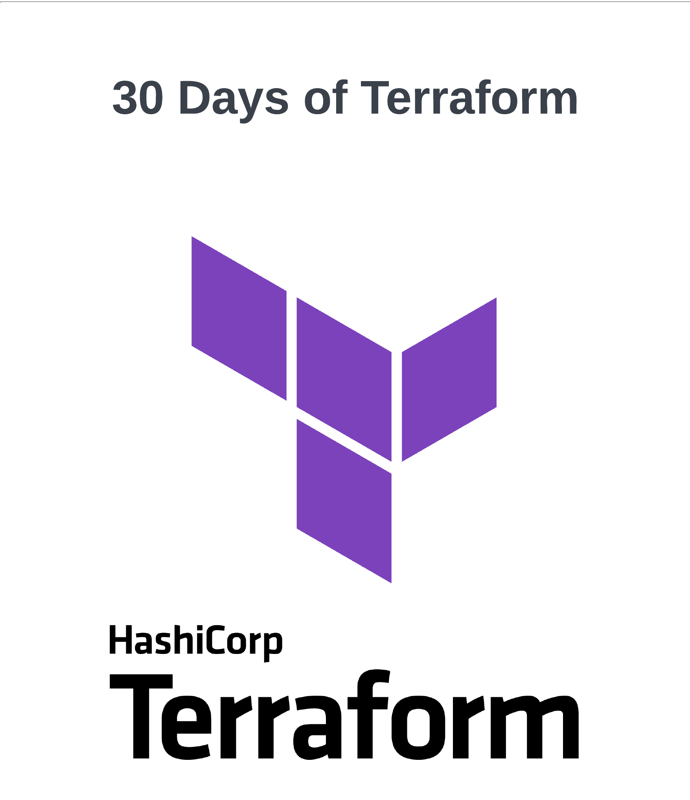

# 30 Days of Terraform

Welcome to the **30 Days of Terraform** challenge! This guide will take you through a month-long journey to learn and master the fundamentals of Terraform, a powerful Infrastructure as Code (IaC) tool.

## How to Use This Guide

Each day of the challenge covers a specific topic related to Terraform. You'll find detailed explanations, examples, and exercises to help you build a solid understanding of Terraform concepts. Feel free to follow along day by day or jump to the topics that interest you the most.

## Table of Contents

| Day | Topics |
| --- | --- |
| [Day 1](./01_Day_Introduction/Introduction.md) | Introduction to Terraform |
| [Day 2](./02_Day_Terraform_Syntax/02_day_terraform_syntax.md) | Terraform Syntax |
| [Day 3](./03_Day_Providers_Variables/03_day_providers_variables.md) | Providers and Variables |
| [Day 4](./04_Day_Resources_Data_Sources/04_day_resources_data_sources.md) | Resources and Data Sources |
| [Day 5](./05_Day_Resource_Lifecycle_Changes/05_day_resource_lifecycle_changes.md) | Input and Output Variables |
| [Day 6](./06_Day_Modules_Remote_State/06_day_modules_remote_state.md) | Loops and Conditionals |
| [Day 7](./07_Day_Terraform_Cloud_Enterprise/07_day_terraform_cloud_enterprise.md) | Cloud enterprise |
| [Day 8](./08_Day_Managing_secrets/08_day_managing_secrets.md) | managing secrets |
| [Day 9](./09_Day_Managing_Environments/09_day_managing_environments.md) | Managing Environments |
| [Day 10](./10_Day_Remote_State/10_day_remote_state.md) | Remote State Management |
| [Day 11](./11_Day_State_Locking_Consistency/11_day_state_locking_consistency.md) | State Locking and Consistency |
| [Day 12](./12_Day_Conditional_Resource_Creation/12_day_conditional_resource_creation.md) | Conditional Resource Creation |
| [Day 13](./13_Day_Dependency_Management/13_day_dependency_management.md) | Dependency Management |
| [Day 14](./14_Day_Functions_Expressions/14_day_functions_expressions.md) | Functions and Expressions |
| [Day 15](./15_Day_Testing_Code_Quality/15_day_testing_code_quality.md) | Testing and Code Quality |
| [Day 16](./16_Day_Code_Organization_Structure/16_day_code_organization_structure.md) | Code Organization and Structure |
| [Day 17](./17_Day_IaC_Best_Practices/17_day_iac_best_practices.md) | IaC Best Practices |
| [Day 18](./18_Day_CI_CD_GitLab/18_day_ci_cd_gitlab.md) | CI/CD with GitLab |
| [Day 19](./19_Day_Managing_Secrets/19_day_managing_secrets.md) | Managing Secrets and Sensitive Data |
| [Day 20](./20_Day_Design_Patterns/20_day_design_patterns.md) | IaC Design Patterns |
| [Day 21](./21_Day_Kubernetes/21_day_kubernetes.md) | Terraform and Kubernetes |
| [Day 22](./22_Day_Serverless_Architecture/22_day_serverless_architecture.md) | Terraform and Serverless Architecture |
| [Day 23](./23_Day_Multi_Cloud_Strategy/23_day_multi_cloud_strategy.md) | Terraform and Multi-Cloud Strategy |
| [Day 24](./24_Day_Immutable_Infrastructure/24_day_immutable_infrastructure.md) | Terraform and Immutable Infrastructure |
| [Day 25](./25_Day_Network_Infrastructure/25_day_network_infrastructure.md) | Terraform and Network Infrastructure |
| [Day 26](./26_Day_State_Visualization_Management/26_day_state_visualization_management.md) | State Visualization and Management |
| [Day 27](./27_Day_Compliance_as_Code/27_day_compliance_as_code.md) | Compliance as Code |
| [Day 28](./28_Day_Monitoring_Logging/28_day_monitoring_logging.md) | Monitoring and Logging Integration |
| [Day 29](./29_Day_Advanced_Topics_Best_Practices/29_day_advanced_topics_best_practices.md) | Advanced Topics and Best Practices |
| [Day 30](./30_Day_Final_Project_Recap/30_day_final_project_recap.md) | Final Project and Recap |

## Stay Motivated!

Congratulations on taking the first step towards mastering Terraform! Remember, consistent practice is key to success. Stay motivated, keep learning, and enjoy your journey through the world of Infrastructure as Code.

Happy coding and automating! 🚀
```

Enjoy and Have Fun
